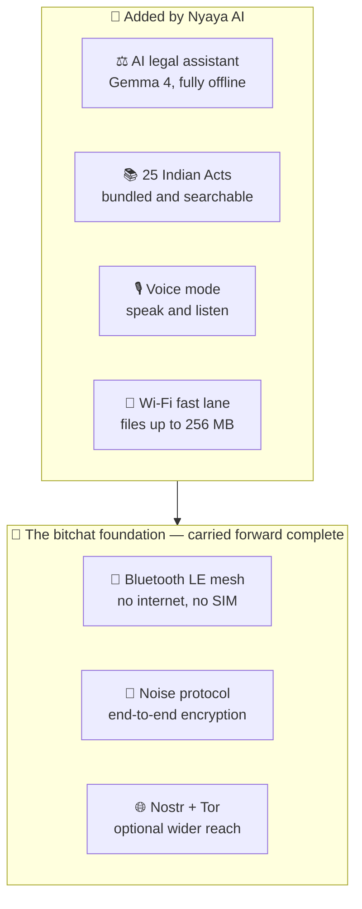
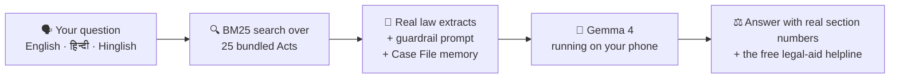
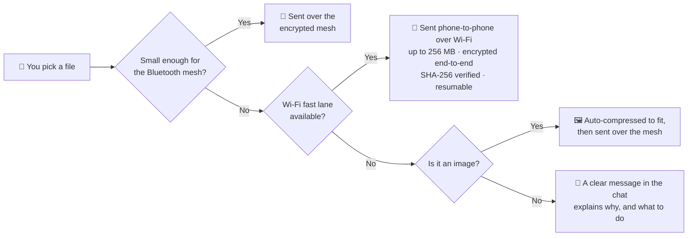

<div align="center">


# Nyaya AI

**Free legal help for India, on your phone, with no internet and no account.**

*न्याय — justice*

Gemma 4 running fully on-device · 25 complete Indian bare acts bundled offline · encrypted Bluetooth mesh messaging · files up to 256 MB over an encrypted Wi-Fi fast lane

[](LICENSE.md)
[](#download)
[](#free-forever)
[](PRIVACY_POLICY.md)

[What it does](#what-this-is) · [What you get](#what-you-get-at-a-glance) · [AI features](#the-ai-legal-assistant) · [Mesh chat features](#encrypted-mesh-chat) · [Legal library](#the-offline-legal-library) · [Privacy](PRIVACY_POLICY.md) · [Terms](TERMS_OF_USE.md) · [Licences](THIRD_PARTY_LICENSES.md) · [Contributing](CONTRIBUTING.md) · [Security](SECURITY.md)

**[⬇ Download the app](#download)**

</div>

---

## What this is

Nyaya AI answers legal questions for people in India who cannot afford a lawyer — students, workers, tenants, anyone. It does two things ordinary apps cannot:

**It works with the internet switched off.** A Gemma 4 model runs on the phone itself and the complete text of 25 Indian Acts is bundled inside the app. Ask *"police refuse to file my FIR, what are my rights?"* in airplane mode and you get an answer grounded in the actual words of BNSS Section 173, together with the free legal aid helpline.

**Nothing you type ever leaves your phone.** There is no account, no server and no telemetry. That matters for the people this is built for — someone asking about domestic violence, a leaked photo, or a police case does not want that question in anyone's logs.


It is built on top of [bitchat](https://github.com/permissionlesstech/bitchat-android), so it also carries bitchat's encrypted Bluetooth-mesh messaging: phones talk to each other directly, with no cell tower and no internet, using the Noise protocol.

### One app, two halves

Both features ship in a single APK behind a **single launcher icon**. Open **Nyaya AI** and the home screen has an **"Encrypted mesh chat"** card that opens the full bitchat messenger; Back returns you to the AI lawyer.

- **[The AI legal assistant](#the-ai-legal-assistant)** — offline answers grounded in 25 Indian Acts.
- **[Encrypted mesh chat](#encrypted-mesh-chat)** — the complete bitchat messenger, every feature included, nothing removed.

The messenger keeps its own activity rather than being redrawn as a screen inside the AI lawyer. That is deliberate: bitchat's `MainActivity` owns the mesh service lifecycle, the Bluetooth onboarding and permission flow, its own back-press handling and several broadcast receivers. Re-hosting its UI elsewhere would mean duplicating all of that, and the bitchat sources in this repository stay as close to upstream as possible — only a small, documented set of files was carefully **extended, never trimmed**, to make file sending more honest and more capable (see [the file fast lane](#sending-big-files-the-wi-fi-fast-lane)) — which keeps future merges from upstream clean. Nyaya also listens for bitchat's force-finish broadcast, so quitting or panic-wiping closes the whole app rather than leaving the AI screen open behind it.

> **This app gives legal information, not legal advice.** It is not a lawyer and does not create a lawyer–client relationship. For anything serious — arrest, court dates, a live FIR — get a real advocate. Free legal aid is a right in India: call **NALSA on 15100**. In an emergency call **112**.

---

## What you get, at a glance

Nyaya AI stands on [bitchat](https://github.com/permissionlesstech/bitchat-android)'s shoulders. Everything bitchat does, this app does — the same protocol, the same encryption, the same mesh, fully compatible with bitchat users on iOS and Android. On top of that foundation, Nyaya AI adds new layers built for people who need legal help on real phones in real conditions.



| Capability | bitchat | **Nyaya AI** |
|---|:---:|:---:|
| **Encrypted messaging** | | |
| Bluetooth LE mesh chat — no internet, no SIM, no account | ✅ | ✅ |
| End-to-end encryption (Noise protocol, X25519, AES-256-GCM) | ✅ | ✅ |
| Channels, private messages, store & forward, multi-hop relay | ✅ | ✅ |
| Nostr geohash channels and bundled Tor | ✅ | ✅ |
| Panic wipe, QR contact verification, packet padding & cover traffic | ✅ | ✅ |
| Cross-platform with bitchat on iOS | ✅ | ✅ |
| Voice notes, images and file transfer over the mesh | ✅ | ✅ |
| **Smarter file sharing** | | |
| A clear in-chat message when a file cannot be delivered | — | ✅ |
| Oversized images automatically re-compressed to fit the mesh | — | ✅ |
| Large private files — up to **256 MB** — over the encrypted Wi-Fi fast lane | — | ✅ |
| Delivery confirmed only after the receiver verifies the file's SHA-256 | — | ✅ |
| Interrupted transfers resume instead of starting over | — | ✅ |
| Receiver checks free storage before accepting | — | ✅ |
| **AI legal help** | | |
| On-device AI lawyer (Gemma 4) that works in airplane mode | — | ✅ |
| 25 complete Indian Acts bundled offline, cited by section | — | ✅ |
| Answers in English, Hindi, Hinglish or your own language | — | ✅ |
| Voice mode — speak the question, hear the answer | — | ✅ |
| Long-conversation "Case File" memory | — | ✅ |
| Saved conversations, encrypted on your phone | — | ✅ |
| Incognito chat — never written to storage | — | ✅ |
| Bring-your-own-key cloud mode (optional) | — | ✅ |
| Offline legal library you can read yourself | — | ✅ |
| Always routes to real help — NALSA 15100, emergency 112 | — | ✅ |

*The point of this table is not that bitchat lacks anything it set out to do — it is a superb messenger, and all of it is in here. The point is that Nyaya AI is the same trusted foundation carried forward, with the updated facilities added so it can help users more powerfully: legal help that works offline, and file sharing that handles real-world sizes honestly.*

---

## The offline legal library

**36 files, ~12 MB, bundled inside the APK.** No download, indexed at launch, searchable with the network off.

**25 complete bare acts**, fetched from official Government of India sources (almost all from `indiacode.nic.in`), with the source URL recorded in every file:

- **Criminal law** — Bharatiya Nyaya Sanhita 2023, Bharatiya Nagarik Suraksha Sanhita 2023, Bharatiya Sakshya Adhiniyam 2023
- **Constitutional & legal aid** — Constitution of India, Legal Services Authorities Act 1987
- **Civil** — Contract Act 1872, Specific Relief Act 1963, Transfer of Property Act 1882, Code of Civil Procedure 1908, Limitation Act 1963
- **Family** — Hindu Marriage Act 1955, Hindu Succession Act 1956, Special Marriage Act 1954, Protection of Women from Domestic Violence Act 2005, Dowry Prohibition Act 1961
- **Consumer & digital rights** — Consumer Protection Act 2019, Information Technology Act 2000, DPDP Act 2023, RTI Act 2005
- **Corporate & tax** — Companies Act 2013, Insolvency and Bankruptcy Code 2016, CGST Act 2017, **Income-tax Act 1961**, **Income-tax Act 2025**
- **Everyday** — Motor Vehicles Act 1988

Plus **10 curated plain-language guides** that bridge everyday words to statute language — emergency helplines, police procedure and FIR, arrest rights, free legal aid, fundamental rights, consumer complaints, data protection, RTI, and online harassment / leaked photos / cyber crime.

### Both income-tax regimes, clearly labelled

India replaced the 1961 Act with the **Income-tax Act, 2025**, in force from **1 April 2026**. Both are bundled, because the old Act still governs every earlier year and any assessment, appeal or prosecution about those years. Each file opens with a status banner that the retriever surfaces alongside the law itself:

- `31_full_income_tax_act_1961_OLD_repealed.md` — **OLD LAW, REPEALED.** Use only for assessment years up to 2025-26.
- `34_full_income_tax_act_2025_NEW_in_force.md` — **NEW LAW, IN FORCE.** Cite this for current questions, and never carry a 1961 section number across, because the numbering differs.

A test enforces those labels, so the app cannot ship with the two regimes confused.

### How retrieval works

Every `.md` file is split into heading-aligned passages and ranked with **Okapi BM25** (`k1=1.2`, `b=0.75`). Length normalisation matters here: the two income-tax acts alone are ~4.5 MB of the library, and without it they drowned out consumer and cyber questions. The top passages are injected into the model's prompt with an instruction to cite section numbers **only** from those extracts, which is what stops the model inventing sections.

### Refreshing the library

```bash
pip install pypdf
python3 tools/kb/fetch_full_kb.py           # all 25 acts
python3 tools/kb/fetch_full_kb.py --only bns
```

The fetcher validates that every download is a real PDF before writing it, retries with backoff, and if a pinned India Code URL has rotted it re-discovers the current one by searching India Code by title. It exits non-zero if any act fails.

---

## The AI legal assistant

*What it can do, and when it helps.*



- **Fully offline answers** — after a one-time model download, works permanently in airplane mode.
- **Grounded in real law (RAG)** — every question searches the 25 bundled Acts and the matching passages are given to the model, which is instructed to cite section numbers **only** from those extracts. This is what stops it inventing sections.
- **BM25 retrieval** over heading-aligned passages, with length normalisation so a few huge statutes cannot drown out everyday questions.
- **Answers in your language** — English, Hindi, Hinglish, or any Indian language you write in.
- **Voice mode** — speak your question and hear the answer read back, for users who cannot type comfortably or read easily.
- **Long-conversation memory** — a rolling "Case File" preserves names, dates, FIR numbers and advice already given, so a 30-message consultation stays coherent instead of overflowing the model's context.
- **Anti-hallucination guardrails** — the system prompt forbids invented case names, citations and section numbers, and requires the model to say when it is unsure.
- **Knows the law changed** — it is told that BNS, BNSS and BSA replaced the IPC, CrPC and Evidence Act from 1 July 2024, and both income-tax regimes are labelled.
- **Always routes to real help** — free legal aid (**NALSA 15100**), emergencies (**112**), and it states plainly that it is not a lawyer.
- **Two engines** — on-device Gemma 4 by default, or your own API key for a cloud model. Your choice, switchable in Settings.
- **Suggested starting questions** for people who do not know how to ask.
- **Your conversations, saved on your phone** — come back to a consultation tomorrow. Encrypted with a key held in the Android Keystore, never uploaded, and kept until *you* delete them. Delete one from the menu, or all of them from Settings.
- **Incognito chat** — for anything you would rather not have on the phone at all: nothing written to storage, no entry in your list, kept out of the Case File, and gone once you start a new conversation or close the app. The top bar says "Incognito · not saved" the whole time, because a private mode you cannot see is one you cannot trust.
- **Offline legal library** — browse and read the full text of every bundled Act yourself, with plain-language guides first and repealed Acts clearly badged. Works even before you download a model.

### Where the AI actually helps

- **The police refuse to register an FIR** — learn about Zero FIR, the written complaint to the Superintendent of Police under BNSS 173(4), and the application to the Magistrate under 175(3).
- **Someone has been detained** — the 24-hour production rule, the right to know the grounds of arrest, the right to inform a relative, the rule against arresting a woman after sunset.
- **Domestic violence or dowry harassment** — what protection orders exist and who to approach.
- **Photos leaked or online harassment** — which BNS and IT Act sections apply, the 24-hour takedown right, and how to report on cybercrime.gov.in.
- **A defective product and a shop refusing a refund** — consumer forum route and limitation periods.
- **Divorce, maintenance, inheritance** — what the personal-law statutes actually say.
- **Filing an RTI** — how the process works.
- **A student needing to understand a law** for study, a moot, or a class assignment.
- **Cannot afford a lawyer at all** — the app's first answer to that is free legal aid, with the number.

---

## Encrypted mesh chat

*The complete bitchat messenger. Every feature included, nothing removed.*

The **entire** bitchat for Android messenger ships inside this app. Nothing was removed, disabled or cut down: the messenger is upstream bitchat at commit `b7f0b33`, complete, with a handful of files deliberately **extended — never trimmed** — to make file sending more honest and more capable (see [the file fast lane](#sending-big-files-the-wi-fi-fast-lane) below). A test in the suite fails if the messenger is ever dropped from the build. Open **Nyaya AI** and tap **"Encrypted mesh chat"** on the home screen to use it.

Why it belongs in a legal-help app: the moment you most need to tell someone your rights is often the moment the network is down, the area has no signal, your data pack has run out, or you do not want a record on a phone company's servers. Mesh chat and offline AI solve the same problem from two directions.

### Messaging and the mesh network

- **Bluetooth LE mesh networking** — phones find each other automatically and form a network with no router, no cell tower, no SIM and no internet.
- **Multi-hop relay** — a message hops phone-to-phone to reach someone out of your direct Bluetooth range, so the group's reach is larger than any one phone's.
- **Wi-Fi Aware transport** — an additional direct phone-to-phone radio path on supported devices, for more range and speed than Bluetooth alone. In Nyaya AI this link also carries the **large-file fast lane** described below.
- **Store and forward** — messages for someone who is offline are held and delivered automatically when they come back in range. You do not have to be online at the same moment.
- **Cross-platform** — protocol-compatible with bitchat on iOS, so Android and iPhone users are on the same mesh.
- **Delivery and read receipts** — you can see that a message actually arrived, which matters when it is important.
- **Signal strength (RSSI) indicators** — see how solid each peer's connection is before relying on it.
- **Nostr relays and geohash channels** — when internet *is* available, reach people in a wider geographic area rather than only those nearby.
- **Bundled Tor** — route that internet traffic through Tor for stronger privacy.

### Groups, channels and contacts

- **Channels** — topic-based group chats, created instantly with `/join #name`.
- **Password-protected channels** — the owner sets a password with `/pass`; keys are derived with Argon2id.
- **Channel ownership and transfer** — hand control to someone you trust with `/transfer`.
- **Message retention, controlled by the channel owner** — `/save` decides whether a channel's messages are kept on device or vanish.
- **Favourites** — mark people so you recognise them across sessions.
- **Block and unblock** — `/block @name` stops someone messaging you.
- **@mentions with autocomplete** — pull a specific person's attention in a busy channel.
- **QR code contact verification** — scan a contact in person to confirm you are talking to who you think you are, not an impostor.
- **Nicknames** — pick a display name; no phone number and no real name required.

### Content you can send

- **Private and group text messages**
- **Voice notes** — record and send audio, useful when typing is hard or the user cannot read comfortably.
- **Images**, with EXIF orientation handled correctly — and if an image is too big for the mesh, the app **re-compresses it automatically to fit** instead of failing.
- **File transfer** over the mesh, with **honest size limits**: the app checks what the receiving phone can actually reassemble *before* sending, and if a file cannot be delivered it says so with a clear message in the chat — never a silent failure or a stuck progress bar.
- **Large files — up to 256 MB — over the Wi-Fi fast lane**, end-to-end encrypted, verified and resumable. Details below.

### Sending big files: the Wi-Fi fast lane

The Bluetooth mesh is built for messages, so it can only deliver small files. When you send something bigger to a private contact, Nyaya AI automatically checks for a faster road:



What the fast lane gives you, concretely:

- **Up to 256 MB per file** — original-quality photos, long voice recordings, scanned documents, video clips.
- **End-to-end encrypted** — every transfer uses a **fresh AES-256-GCM key**, exchanged inside the already-encrypted Noise session, and every piece of the file is authenticated. Tampered data is rejected, never delivered.
- **Direct phone-to-phone** — the file travels straight over the Wi-Fi Aware link between the two phones. No server, no relay, no third phone ever carries it.
- **Verified delivery** — the send is marked delivered only after the receiving phone confirms the file's **SHA-256 fingerprint** matches. What arrives is exactly what was sent, or it is discarded.
- **Resumable** — if the link drops mid-transfer, the send resumes from where it stopped instead of starting over.
- **Polite to the receiver** — the receiving phone checks its free storage before accepting, and can decline.
- **Live progress and cancel** — the same progress ring and cancel button as every other transfer.
- **Streams from disk** — files are read and written in small chunks, so a 100 MB send never bloats the app's memory.

The fast lane needs **Wi-Fi Aware** hardware on both phones (most mid-range and flagship Android phones from recent years have it). When it is not available, nothing breaks: images are fitted to the mesh automatically, and anything else gets an honest, visible explanation in the chat.

### Security and privacy

- **End-to-end encryption** using the **Noise protocol** for private messages — nobody in the middle of the mesh can read them, including phones that relay them.
- **X25519 / Curve25519** key exchange, **AES-256-GCM** message encryption, **Ed25519** digital signatures for authenticity, **Argon2id** for channel passwords.
- **Per-transfer keys for large files** — each fast-lane transfer is protected by its own fresh AES-256-GCM key, exchanged inside the Noise session; every frame is authenticated, and a frame redirected at the wrong transfer or rewritten as a different message type fails closed.
- **No accounts, no phone numbers, no email, no persistent identifier.**
- **Ephemeral by default** — messages live in device memory unless a channel owner turns retention on.
- **Packet padding and cover traffic** — message sizes and timing are obscured so an observer cannot infer much from traffic patterns.
- **Emergency wipe (panic mode)** — instantly destroy identity keys and data. In this app it closes the whole application, AI screen included.
- **Screenshots disabled** in the Android recents screen.
- **No servers at all** in Bluetooth mesh mode, so there is nothing to subpoena, breach or sell.

### Running well on a real phone

- **Background mesh foreground service** — keeps receiving messages while you use other apps.
- **Battery optimisation** — adaptive scanning and power modes instead of draining the battery.
- **LZ4 message compression** — roughly 30–70% less data on typical text, which matters on a slow mesh.
- **Jetpack Compose / Material 3 UI**, dark and light themes, haptic feedback, adaptive layouts.
- **Notifications** for incoming messages.
- **Guided onboarding** for Bluetooth and permissions.
- **Runs on Android 8.0+** — the messenger works even on old 32-bit phones that cannot run the offline AI.

### Commands

Verified against `CommandProcessor` in this build:

| Command | What it does |
|---|---|
| `/join #channel` or `/j` | Join or create a channel |
| `/msg @name text` or `/m` | Send a private message |
| `/w` | List who is online |
| `/channels` | Show all discovered channels |
| `/block @name` / `/block` | Block someone / list blocked peers |
| `/unblock @name` | Unblock someone |
| `/pass [password]` | Set or change the channel password (owner only) |
| `/transfer @name` | Transfer channel ownership |
| `/save` | Toggle message retention for the channel (owner only) |
| `/clear` | Clear the messages on screen |
| `/hug @name`, `/slap @name` | Fun actions |

### Where mesh chat actually helps

- **A protest, rally or large gathering** where the mobile network is congested or has been shut down, and people need to coordinate and share their rights.
- **A power cut, flood, cyclone or earthquake** with towers down — neighbours can still reach each other, and one person with the AI model can relay legal or procedural information to everyone.
- **Villages and remote areas** with no reliable coverage, where a group of phones forms its own network.
- **A police station, court complex or hospital** with no signal inside the building.
- **A student hostel or campus** — free group chat with no data pack.
- **Anyone who does not want a record** with a telecom operator of who they spoke to about a legal problem, which is the situation for many domestic-violence and harassment cases.
- **No SIM, no credit, no data pack** — none of it is required.

For the messenger's own deeper documentation, see upstream [bitchat for Android](https://github.com/permissionlesstech/bitchat-android).

---

## Two AI engines

| | On-device (default) | Cloud (bring your own key) |
|---|---|---|
| Privacy | Nothing leaves the phone | Sent to the endpoint you choose |
| Works offline | Yes | No |
| Cost | Free | Your own API billing |
| Setup | One 2.4 GB download | Paste a key |

### On-device: Gemma 4 via LiteRT-LM

| Model | Download | RAM | Notes |
|---|---|---|---|
| **Gemma 4 E2B** (default) | 2.4 GB | 4 GB+ | Recommended. Good answers on most mid-range phones. |
| **Gemma 4 E4B** | 3.4 GB | 6 GB+ | Stronger multi-step reasoning, needs a better phone. |

Both are the Apache-2.0 `.litertlm` builds from [litert-community](https://huggingface.co/litert-community), run through Google's **LiteRT-LM** runtime. They are **not licence-gated**, so no Hugging Face account or token is needed. The runtime applies each model's own chat template, tries the **GPU** first (faster and lighter on RAM) and falls back to CPU automatically.

On-device AI needs a **64-bit** phone (`arm64-v8a`). On 32-bit devices the mesh chat still works and you can use your own API key.

### Cloud: any OpenAI-compatible endpoint

OpenAI, Groq, OpenRouter, a self-hosted vLLM or Ollama — anything that speaks `/chat/completions`. Your key is stored in Android Keystore-encrypted preferences and is only ever sent to the endpoint you configured.

---

## The interface

Rebuilt in v1.9.0 around a single design system (`ui/theme/NyayaTheme.kt`) rather than colours hard-coded per screen — which is why it now supports a light theme at all.

- **One question per screen.** The home screen is the brand mark, "How can I help?", and the input bar. The previous version stacked five competing calls to action on a first-time user.
- **A calm canvas.** Near-white deepening into cornflower blue, with the hero lifted on a soft glow. Full light and dark schemes, following the system setting.
- **A floating pill input bar** — `+` for actions, the field, mic, and one trailing action that is *either* send or stop, never both, so a reply cannot be double-submitted.
- **A navigation drawer where the two modes are peers.** Nyaya AI and Mesh chat sit side by side, with your saved conversations, search, the legal library and settings. Mesh chat is no longer a card buried in the middle of a screen.
- **Answers are not in bubbles.** A legal answer runs to paragraphs with section numbers; boxing that at a fixed width makes it markedly harder to read. Your messages are in a tinted pill, the answer is plain text on the canvas, with copy and read-aloud beneath it.
- **A voice orb that reacts to your voice** rather than animating on a timer — the microphone amplitude drives it, so it is obvious the app is listening without printing a status line.
- **The engine is always on screen.** Whether an answer came from the on-device model or your own cloud key changes both its privacy and its accuracy, so the top bar states which is active instead of hiding it in settings.

The design references are in [`docs/ui-inspiration/`](docs/ui-inspiration).

## Free forever

Nyaya AI is **free of charge to every user, permanently**. No subscription, no paid tier, no advertising, no in-app purchase, no "pro" version, no data sold. It was built to help people who cannot afford a lawyer, and charging them would defeat the point.

It is also **free software** under the GNU General Public License v3.0 or later: you may use it, read it, modify it and share it. If you distribute a modified version you must pass those same freedoms on. See [LICENSE.md](LICENSE.md) and [THIRD_PARTY_LICENSES.md](THIRD_PARTY_LICENSES.md).

---

## Download

<div align="center">

### Just click and install — no account, no sign-up, free

[](https://github.com/Dhanrajs-Purament/nyaya-ai/releases/download/v1.10.0-nyaya/Nyaya-AI-v1.10.0-1-RECOMMENDED-most-phones.apk)

**↑ Start here.** Works on every Android phone sold in roughly the last eight years.

[](https://github.com/Dhanrajs-Purament/nyaya-ai/releases/download/v1.10.0-nyaya/Nyaya-AI-v1.10.0-2-BACKUP-works-on-all-phones.apk)

**↑ Only if the green one refuses to install.** Same app, contains every CPU type, so it is bigger.

<sub>Version 1.10.0 · Requires Android 8.0+ · The offline AI additionally needs a 64-bit phone with 4 GB+ RAM · Free forever, no ads, no tracking</sub>

</div>

<details>
<summary><b>Other downloads</b> — old 32-bit phones, emulators, ChromeOS, and checksums</summary>

<br>

| Download | Who it is for | Size |
|---|---|---|
| [Old 32-bit phones](https://github.com/Dhanrajs-Purament/nyaya-ai/releases/download/v1.10.0-nyaya/Nyaya-AI-v1.10.0-3-old-32-bit-phones.apk) | Very old budget phones. Mesh chat works, but **the offline AI cannot run on 32-bit devices**. | 16 MB |
| [Emulator / ChromeOS 64-bit](https://github.com/Dhanrajs-Purament/nyaya-ai/releases/download/v1.10.0-nyaya/Nyaya-AI-v1.10.0-4-emulator-and-ChromeOS-64-bit.apk) | Developers, and some ChromeOS devices. | 44 MB |
| [Emulator 32-bit](https://github.com/Dhanrajs-Purament/nyaya-ai/releases/download/v1.10.0-nyaya/Nyaya-AI-v1.10.0-5-emulator-32-bit.apk) | Developers only. | 21 MB |
| [SHA256SUMS.txt](https://github.com/Dhanrajs-Purament/nyaya-ai/releases/download/v1.10.0-nyaya/SHA256SUMS.txt) | Checksums, to verify your download is genuine. | — |

All five APKs are the **same app**. They differ only in which CPU type they carry.

Verify a download:

```bash
sha256sum -c SHA256SUMS.txt --ignore-missing
```

Or browse [**all releases**](https://github.com/Dhanrajs-Purament/nyaya-ai/releases/latest).

</details>

### After you download

1. **Tap the downloaded file.**
2. Android will ask permission to **"install from unknown sources"** — allow it. This app is not on the Play Store, so Android asks by default.
3. Open **Nyaya AI**.
4. **Settings → pick a model → Download & load model.** Use Wi-Fi; this is a large one-time download. **No account and no token needed.**
5. Ask your question — in English, Hindi, Hinglish or your own language.

**Do not want a 2.4 GB download?** Skip step 4 and paste your own API key in Settings instead. Or use the encrypted mesh chat, which needs no model at all.

---

## Documentation

| Document | What it covers |
|---|---|
| [PRIVACY_POLICY.md](PRIVACY_POLICY.md) | What is stored, what never leaves your phone, every permission and why |
| [TERMS_OF_USE.md](TERMS_OF_USE.md) | Legal disclaimer, acceptable use, no-warranty terms |
| [LICENSE.md](LICENSE.md) | GNU GPL v3.0 full text |
| [THIRD_PARTY_LICENSES.md](THIRD_PARTY_LICENSES.md) | bitchat, Gemma 4, LiteRT-LM, every library, and the legal texts' provenance |
| [SECURITY.md](SECURITY.md) | How to report a vulnerability privately |
| [CONTRIBUTING.md](CONTRIBUTING.md) | How to help, including without writing code |
| [CODE_OF_CONDUCT.md](CODE_OF_CONDUCT.md) | Community standards |
| [CHANGELOG.md](CHANGELOG.md) | Release history |
| [docs/nyaya/ARCHITECTURE.md](docs/nyaya/ARCHITECTURE.md) | Deeper technical design |

---

## Build from source

Requires JDK 17+, Android SDK with platform 35 and build-tools 35, and about 3 GB of disk.

```bash
git clone https://github.com/Dhanrajs-Purament/nyaya-ai.git
cd nyaya-ai
echo "sdk.dir=$ANDROID_HOME" > local.properties

pip install pypdf && python3 tools/kb/fetch_full_kb.py   # populate the legal library

./gradlew testDebugUnitTest      # run the unit tests
./gradlew assembleDebug          # debug APKs
./gradlew assembleRelease        # release APKs (unsigned unless configured below)
```

### Signing a release

Create `keystore.properties` at the repository root — it is git-ignored, and the release build stays unsigned without it:

```properties
storeFile=/absolute/path/to/nyaya-release.jks
storePassword=…
keyAlias=nyaya
keyPassword=…
```

### Packaging a release

Gradle names its outputs after the CPU architecture, which is meaningless to end
users. This renames them to the self-explaining names used on the release page
and writes checksums:

```bash
./gradlew assembleRelease
tools/release/package_release.sh          # -> build/release-downloads/
```

### Regenerating the launcher icon

The vector drawables in `app/src/main/res/drawable/ic_launcher_*.xml` are the source of truth. To refresh the legacy density PNGs:

```bash
pip install pillow && python3 tools/branding/render_launcher_icons.py
```

### Building on an ARM64 Linux host

Google ships `aapt2` for Linux as x86-64 only, and Robolectric has no `linux-aarch64` native runtime. Both are handled: install `qemu-user-static` and export `QEMU_LD_PREFIX=/usr/x86_64-linux-gnu`, and the build automatically switches Robolectric to its legacy graphics/SQLite backends on aarch64 Linux only, leaving x86-64 CI on the native path.

---

## Architecture

```
app/src/main/java/com/bitchat/android/nyaya/
├── ai/
│   ├── LegalKnowledgeBase.kt   BM25 retrieval over the bundled acts
│   ├── OnDeviceLlmEngine.kt    Gemma 4 via LiteRT-LM, GPU→CPU fallback
│   ├── CloudLlmEngine.kt       BYOK, any OpenAI-compatible endpoint
│   ├── AiRouter.kt             picks the engine that is ready
│   ├── NyayaModelCatalog.kt    the Gemma 4 models, sizes and magic bytes
│   ├── ModelDownloadManager.kt resumable download + integrity verification
│   └── LawyerSystemPrompt.kt   scope, honesty and safety-routing rules
├── history/ChatHistoryStore.kt   encrypted saved conversations
├── memory/ConversationMemory.kt  rolling "Case File" for long consultations
├── settings/NyayaSettings.kt     Keystore-encrypted preferences
├── transfer/
│   ├── MeshTransferLimits.kt     honest size limits derived from the real receiver caps
│   └── bulk/
│       ├── BulkFrames.kt         fast-lane wire format + AES-256-GCM framing
│       └── BulkTransferManager.kt chunked send/receive, resume, SHA-256 verification
├── ui/                            Compose screens: home, chat, voice, settings
└── voice/VoiceManager.kt          speech in, speech out
```

**Answering a question:** the question is tokenised → BM25 finds the most relevant passages across the bundled acts → those passages plus the guardrail system prompt plus the running Case File go to whichever engine is active → the reply is appended to memory, and older turns are compacted into the Case File so a long conversation never overflows the model's context.

**Model download:** verified against the exact expected byte count and the `LITERTLM` file header before the partial file is promoted, so an interrupted 2.4 GB transfer can never masquerade as a working model. Interrupted downloads resume.

**Sending a large file:** the sender offers the file inside the Noise-encrypted session, with the file's SHA-256, its size and a fresh AES-256-GCM key. The receiver checks free storage, accepts, and the file streams across in authenticated 48 KB chunks with acknowledgements driving the progress ring. If the link drops, a re-offer resumes from the last chunk the receiver holds. Delivery is confirmed only after the receiver's own SHA-256 of the assembled file matches the offer. See [docs/nyaya/ARCHITECTURE.md](docs/nyaya/ARCHITECTURE.md) for the full design.

---

## The brand mark


The icon is one shape carrying all three halves of the product. A **shield** for encryption and privacy, the bitchat heritage. **Scales of justice** for Indian law. And the beam of those scales is a **network graph** — two amber mesh nodes with an AI node at the apex feeding into the fulcrum — so the legal symbol and the encrypted-AI-network symbol are the same object rather than two logos pushed together. Indigo shading into teal: institutional trust moving into on-device intelligence.

<br clear="left" />

---

## Privacy

- No account, no sign-up, no analytics, no crash reporting, no ads.
- In on-device mode, questions and answers never leave the phone. There is no server to leak.
- API keys and the optional Hugging Face token are held in Android Keystore-encrypted preferences.
- Mesh messages are end-to-end encrypted with the Noise protocol; large file transfers add a fresh per-transfer AES-256-GCM key exchanged inside that session.
- The only network traffic the AI features ever make is the one-time model download, and whatever you explicitly send in BYOK cloud mode.

See [PRIVACY_POLICY.md](PRIVACY_POLICY.md).

---

## Testing

More than 200 unit tests:

```bash
./gradlew testDebugUnitTest          # JVM + Robolectric
./gradlew connectedDebugAndroidTest  # needs a device: AndroidKeyStore crypto
```

The Nyaya tests run against the **real bundled legal library**, not fixtures. They prove that an FIR-refusal question retrieves BNSS Section 173 with the Superintendent-of-Police and Magistrate remedies, that the NALSA 15100 helpline is reachable, that both income-tax regimes are labelled, that every act came from an official source, that a 30-turn conversation compacts without losing facts, and that no hard-coded Gemma chat-template markers ever creep back in.

The file fast lane has its own wire-format suite: a tampered frame, a frame rewritten as a different message type, or a frame redirected at another transfer must all fail closed; a Devanagari file name (सबूत-photo.jpg) must round-trip intact; and the largest encrypted chunk must stay under the socket layer's 64 KB frame cap.

Keystore-backed crypto is tested under `src/androidTest`, because `AndroidKeyStore` does not exist on the JVM and Robolectric does not emulate it.

---

## Honest status

Built, compiling and tested — **but not yet validated on a physical phone.** The build is clean, the release APK is signed, and the offline legal retrieval is covered by passing tests. What no test here can establish is **answer quality**: whether Gemma 4 E2B actually gives good, safe legal guidance on a real device. That needs a human reading real answers, and it is the next step.

Known limitations:

- A tenancy question about a "security deposit" retrieves company law, because "securities" and "deposits" are strong company-law terms. Pinned by a test so it stays visible; needs phrase-level matching to fix.
- The Income-tax Act 2025 is not published on `indiacode.nic.in` or any reachable `.gov.in` host, so it comes from PRS Legislative Research's copy of the text as passed by Lok Sabha. The file says so.
- 2.4 GB is a heavy download for the users this is aimed at. There is no smaller Gemma 4.
- The Wi-Fi file fast lane needs **Wi-Fi Aware** hardware on both phones; many budget phones do not have it. Where it is missing, the app falls back to the honest mesh behaviour — images auto-fitted, everything else explained visibly. Like the rest of the app, the fast lane has passed its test suite but still needs a two-phone field test.

---

## Credits & licence

Built on [bitchat-android](https://github.com/permissionlesstech/bitchat-android). On-device inference by [Google AI Edge LiteRT-LM](https://developers.google.com/edge/litert-lm/overview) with [Gemma 4](https://huggingface.co/google/gemma-4-E2B-it). Legal texts from [India Code](https://www.indiacode.nic.in/), the Government of India's official repository.

See [LICENSE.md](LICENSE.md). Gemma models are covered by their own terms; the `.litertlm` bundles used here are Apache-2.0.
